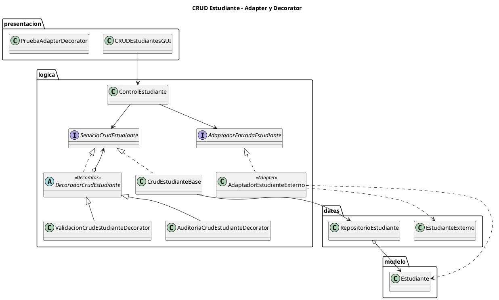

# CRUD Estudiante - Adapter y Decorator

## Revision segun rubrica

| Criterio | Estado | Evidencia |
| --- | --- | --- |
| Aplicacion de Adapter | Cumplido | `EstudianteExterno(codigo, nombreCompleto, anios)` se adapta a `Estudiante(id, nombre, edad)` mediante `AdaptadorEstudianteExterno`. |
| Aplicacion de Decorator | Cumplido | `ValidacionCrudEstudianteDecorator` y `AuditoriaCrudEstudianteDecorator` extienden el CRUD sin modificar `CrudEstudianteBase`. |
| Integracion arquitectonica | Cumplido | Presentacion usa `ControlEstudiante`; Logica coordina Adapter y Decorator; Datos conserva repositorio y fuente externa simulada; Modelo conserva `Estudiante`. |
| Justificacion y evidencias | Cumplido | Este README incluye justificacion, diagrama PlantUML y prueba de consola. |

## Escenario

El CRUD interno trabaja con el modelo `Estudiante(id, nombre, edad)`.
Para la actividad se simula una fuente externa, como CSV o JSON, que entrega los
datos con otros nombres: `codigo`, `nombreCompleto`, `anios`.

## Adapter

El Adapter resuelve la incompatibilidad entre la entrada externa y el modelo del
sistema:

```text
EstudianteExterno(codigo, nombreCompleto, anios)
        |
        v
AdaptadorEstudianteExterno
        |
        v
Estudiante(id, nombre, edad)
```

Clases involucradas:

- `datos.EstudianteExterno`: representa el formato externo.
- `logica.AdaptadorEntradaEstudiante`: contrato del adapter.
- `logica.AdaptadorEstudianteExterno`: convierte la entrada externa al modelo interno.
- `modelo.Estudiante`: entidad usada por el CRUD.

## Decorator

El Decorator permite extender el CRUD sin modificar la clase base.

```text
ServicioCrudEstudiante
        ^
        |
CrudEstudianteBase
        ^
        |
DecoradorCrudEstudiante
        ^
        |
ValidacionCrudEstudianteDecorator / AuditoriaCrudEstudianteDecorator
```

Clases involucradas:

- `logica.ServicioCrudEstudiante`: interfaz comun del servicio CRUD.
- `logica.CrudEstudianteBase`: operaciones base contra el repositorio.
- `logica.DecoradorCrudEstudiante`: clase abstracta que envuelve otro servicio.
- `logica.ValidacionCrudEstudianteDecorator`: valida datos, IDs duplicados y regla de eliminacion.
- `logica.AuditoriaCrudEstudianteDecorator`: agrega mensajes de auditoria a operaciones exitosas.
- `datos.RepositorioEstudiante`: persistencia en memoria.

## Diagrama PlantUML

El diagrama actualizado esta en:

```text
diagrama_adapter_decorator.puml
```

Contenido PlantUML principal:



## Justificacion tecnica

Adapter mejora la mantenibilidad porque encapsula la traduccion del formato
externo en una sola clase. Si cambia la fuente externa, no se modifica el CRUD ni
el modelo interno.

Decorator mejora la extensibilidad porque permite agregar validacion y auditoria
envolviendo el servicio base. El CRUD base mantiene una responsabilidad simple:
guardar, actualizar, eliminar, buscar y listar.

Ambos patrones reducen acoplamiento y respetan la arquitectura de tres capas:
presentacion usa `ControlEstudiante`, logica coordina adapters/decorators y datos
mantiene el repositorio y la entrada externa simulada.

## Matriz de trazabilidad global integrada

| Requisito / entrada | U2T1 Arquitectura | U2T2 Patrones estructurales | U2T3 Patrones de comportamiento | Evidencia final | Control de coherencia |
| --- | --- | --- | --- | --- | --- |
| RF priorizados del CRUD | Se implementan operaciones base del estudiante: registrar, consultar, actualizar y eliminar. | Se adaptan entradas externas y se extienden funcionalidades del CRUD. | Se agregan eventos del CRUD y estrategias de busqueda. | Codigo, diagramas PlantUML y pruebas de consola. | Ningun patron debe aparecer sin requisito asociado. |
| RNF de mantenibilidad | Se separan responsabilidades por capas. | Se reducen cambios directos con Adapter y Decorator. | Se facilita el cambio de comportamiento con Observer y Strategy. | Justificacion tecnica en los README. | La solucion debe ser mas flexible, no mas compleja innecesariamente. |
| Arquitectura | Se definen Presentacion, Logica de negocio, Datos y Modelo. | Los patrones estructurales se insertan respetando las capas. | Los patrones de comportamiento se ubican principalmente en la logica de negocio. | Esquemas PlantUML actualizados. | La presentacion no debe asumir responsabilidades de datos o reglas complejas. |
| Diseno orientado a objetos | Se identifican clases, metodos y responsabilidades. | Se aplican patrones estructurales Adapter y Decorator. | Se aplican patrones de comportamiento Observer y Strategy. | Diagramas de clases/componentes. | Los diagramas deben coincidir con la implementacion. |
| Evidencias de funcionamiento | Se ejecuta el CRUD base. | Se demuestra adaptacion y extension. | Se demuestra notificacion y cambio de estrategia. | Capturas, pruebas o demos de consola. | Cada evidencia debe vincularse a una tarea y requisito. |

## Como ejecutar

Desde PowerShell, ubicarse en la carpeta padre de `Implementacion`, es decir,
la carpeta que contiene el directorio `Implementacion`.

Compilar todos los archivos Java:

```powershell
javac (Get-ChildItem "Implementacion" -Recurse -Filter *.java | Select-Object -ExpandProperty FullName)
```

Ejecutar la interfaz grafica del CRUD:

```powershell
java Implementacion.presentacion.CRUDEstudiantesGUI
```

Ejecutar la prueba de consola para evidenciar Adapter y Decorator:

```powershell
java Implementacion.presentacion.PruebaAdapterDecorator
```

## Evidencias de comportamiento

Antes del cambio, las opciones de agregado dependian de Builder y Prototype.
Despues del cambio, la opcion de agregado usa Adapter y las operaciones CRUD pasan
por decorators de validacion y auditoria.

Prueba de consola:

```powershell
javac (Get-ChildItem "Implementacion" -Recurse -Filter *.java | Select-Object -ExpandProperty FullName)
java Implementacion.presentacion.PruebaAdapterDecorator
```

Salida esperada:

```text
=== Adapter: entrada externa codigo/nombreCompleto/anios ===
Agregado exitosamente: Ana Torres [Decorator: auditoria CREATE]
Agregado exitosamente: Luis Perez [Decorator: auditoria CREATE]
Error: Ya existe un estudiante con el ID 1.

=== Decorator: validacion y auditoria ===
Actualizado exitosamente: ID 1 [Decorator: auditoria UPDATE]
Error: Regla academica - no se puede eliminar a 'Luis Perez' porque es menor de 18 anios (Edad: 17).
Eliminado exitosamente: Ana Torres Actualizada (ID 1) [Decorator: auditoria DELETE]

=== Lista final ===
Estudiante [ID=2, Nombre=Luis Perez, Edad=17]
```
